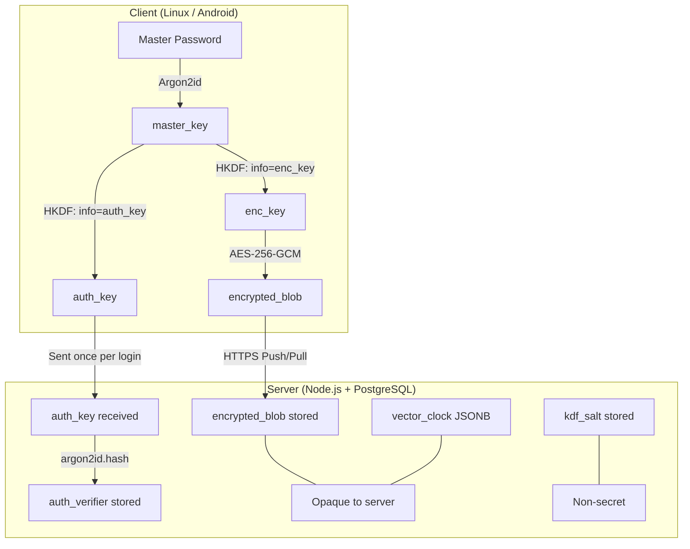

# Zero-Knowledge Password Manager

A production-ready, zero-knowledge password manager with end-to-end encryption.
Syncs between a **Linux desktop** (Python + GTK4) and an **Android** app
(Kotlin + Jetpack Compose), backed by a **Node.js/Express** API with PostgreSQL.

The server **never** sees your passwords. All encryption and decryption happens
exclusively on your devices.

---

## 1. Architecture Overview



### HKDF Key Separation

One master password produces **two cryptographically independent keys** via HKDF:

| Key | Purpose | Leaves Client? | Stored on Server? |
|-----|---------|----------------|-------------------|
| `master_key` | Intermediate — input to HKDF | ❌ Never | ❌ Never |
| `enc_key` | Encrypts/decrypts the vault blob | ❌ Never | ❌ Never |
| `auth_key` | Proves identity to the server | ✅ Once per login | ❌ Only as argon2id hash |

Even if `auth_key` leaks from the server, `enc_key` **cannot** be derived from it.
HKDF outputs with different `info` values are cryptographically independent.

---

## 2. Security Model

### What the server stores

| Field | Content | Secret? |
|-------|---------|---------|
| `auth_verifier` | argon2id hash of `auth_key` | Server-side hash |
| `kdf_salt` | 16 random bytes (base64) | Non-secret (like a bcrypt salt) |
| `encrypted_blob` | `base64(iv + ciphertext + tag)` | Opaque — server cannot decrypt |
| `vector_clock` | `{ "device-id": counter }` | Opaque metadata |

### What the server CANNOT see

- Master password
- `master_key`, `enc_key`, `auth_key` in plaintext
- Any vault item (names, usernames, passwords, URLs, notes)

### Threat Model

**Protects against:**

- **Server breach**: Attacker gets `auth_verifier` (argon2id hash) and
  `encrypted_blob`. Cannot derive `enc_key` from `auth_key` hash.
  Cannot decrypt vault without `enc_key`.
- **Network interception (MITM)**: All traffic over HTTPS. `auth_key` is
  a derived value, not the master password. Even if intercepted, it cannot
  produce `enc_key`.
- **Stolen device without biometric** (Android): `enc_key` is wrapped by
  Android Keystore. Without biometric authentication, the wrapped key
  cannot be unwrapped.
- **Rogue server operator**: Cannot read vault contents. Cannot derive
  encryption keys from stored data.

**Does NOT protect against:**

- **Compromised client device with memory access**: If an attacker has root
  access to a device while the vault is unlocked, they can read `enc_key`
  from process memory.
- **Weak master password**: Argon2id slows brute-force but cannot prevent
  it if the password has low entropy. Use a strong, unique master password.
- **Keylogger on the client**: Master password captured at input time.
- **Supply-chain attacks**: Compromised dependencies could exfiltrate keys.

---

## 3. Backend Setup

### Prerequisites

- Docker & Docker Compose (recommended), OR
- Node.js 20+, PostgreSQL 16+

### Option A: Docker (Recommended)

```bash
cd password-manager

# Generate RS256 key pair
openssl genrsa -out backend/private.pem 2048
openssl rsa -pubout -in backend/private.pem -out backend/public.pem

# Copy and configure environment
cp backend/.env.example backend/.env
# Edit backend/.env with your settings

# Start services
docker-compose up -d

# Run migration (first time only)
docker-compose exec postgres psql -U vaultuser -d vaultdb \
  -f /docker-entrypoint-initdb.d/001_init.sql
```

### Option B: Manual Setup

```bash
cd password-manager/backend

# Install dependencies
npm install

# Set up PostgreSQL database
createdb vaultdb

# Run migration
psql -U $PGUSER -d vaultdb -f migrations/001_init.sql

# Generate RS256 key pair
openssl genrsa -out private.pem 2048
openssl rsa -pubout -in private.pem -out public.pem

# Configure environment
cp .env.example .env
# Edit .env with your database URL and settings

# Start server
node server.js
```

---

## 4. Linux Client Setup

### System Dependencies (Ubuntu/Debian)

```bash
sudo apt install python3-gi python3-gi-cairo gir1.2-gtk-4.0 libgtk-4-dev
```

### Fedora

```bash
sudo dnf install python3-gobject gtk4-devel
```

### Python Environment

```bash
cd password-manager/linux-client

python3 -m venv venv
source venv/bin/activate
pip install -r requirements.txt

# Set the server URL (must be HTTPS in production)
export VAULT_SERVER_URL="https://your-server.example.com"

# Run the application
python3 main.py
```

### Configuration Directory

The app creates `~/.config/vaultmanager/` on first launch (chmod 700) with:
- `device_id` — UUID v4, unique to this device (chmod 600)
- `refresh_token` — opaque token for session persistence (chmod 600)
- `vault.db` — SQLite database with cached encrypted vault (chmod 600)

---

## 5. Android Client Setup

### Prerequisites

- Android Studio Hedgehog (2023.1.1) or later
- Android SDK 34+
- NDK (for argon2kt native compilation)

### Build & Install

```bash
cd password-manager/android-client

# Build debug APK
./gradlew assembleDebug

# Install on connected device
adb install app/build/outputs/apk/debug/app-debug.apk
```

### Configuration

1. **Set server URL**: Edit `SyncApiClient.kt` — update `BASE_URL` constant
2. **Enable Autofill**: Settings → System → Languages & Input → Autofill Service
   → Select "VaultManager"
3. **Biometric Setup**: Ensure fingerprint/face is enrolled in device settings

### Security Features

- `FLAG_SECURE` on all windows (no screenshots, no app-switcher preview)
- 5-minute idle auto-lock
- Passwords handled as `CharArray` (never `String`)
- `enc_key` wrapped by Android Keystore AES key
- Biometric unlock via Keystore biometric-bound key
- Process death = re-authentication required

---

## 6. API Endpoints

| Method | Path | Auth | Purpose |
|--------|------|------|---------|
| POST | `/api/auth/prelogin` | ❌ | Get `kdf_salt` for key derivation |
| POST | `/api/auth/register` | ❌ | Create account |
| POST | `/api/auth/login` | ❌ | Authenticate, get tokens |
| POST | `/api/auth/refresh` | ❌ | Refresh access token |
| POST | `/api/auth/logout` | ✅ | Revoke refresh token |
| GET | `/api/sync/pull` | ✅ | Fetch encrypted vault |
| POST | `/api/sync/push` | ✅ | Push encrypted vault |
| GET | `/api/user/profile` | ✅ | Get user profile |
| DELETE | `/api/user/account` | ✅ | Delete account (re-auth required) |

All errors use the standard envelope: `{ "error": "CODE", "message": "..." }`

---

## License

This project is provided as-is for educational and personal use.
